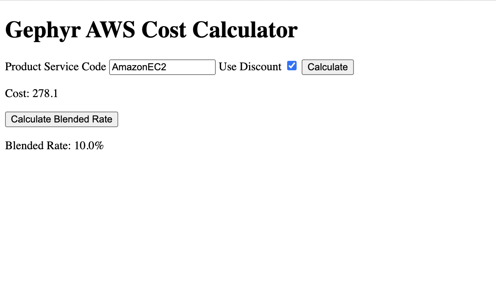

# Gephyr

Gephyr is a small application that allows you to import AWS usage data from a parquet file and query it using a web interface or REST API.

## Setup

Prerequisites:

- Python 3.12+ (NOTE: earlier versions of Python 3 may work, but have not been tested)
- pip
- a parquet file containing usage data

Install the dependencies:

```
pip install -r requirements.txt
```

Create a .env file with the path to your parquet file and desired database path. You can start by copying the .env.example file, but make sure the path to your parquet file is correct.

```
cp .env.example .env
```

## Usage

### Loading Data

To load data into the database, run the following command:

```
python load_data.py
```

This will load the parquet file at the path specified in the .env file into the database at the path specified in the .env file.

### Running the Application

To run the application with the flask development server, run the following command: (Be sure to load data into the database first)

```
flask run
```

## API Endpoints

### GET /api/cost

Get the cost of a product by product_servicecode.
Setting the `use_discount` query parameter to `'true'` will apply the discount percentage specified in the discounts.json file for that product.

### GET /api/blended

Get the blended rate for all usage.

## Web Interface

The web interface is a simple form that allows you to enter a product service code and choose whether or not to apply a discount.
It will then display the total usage cost of the selected product.

It also includes a button to calculate the blended rate for all usage.


